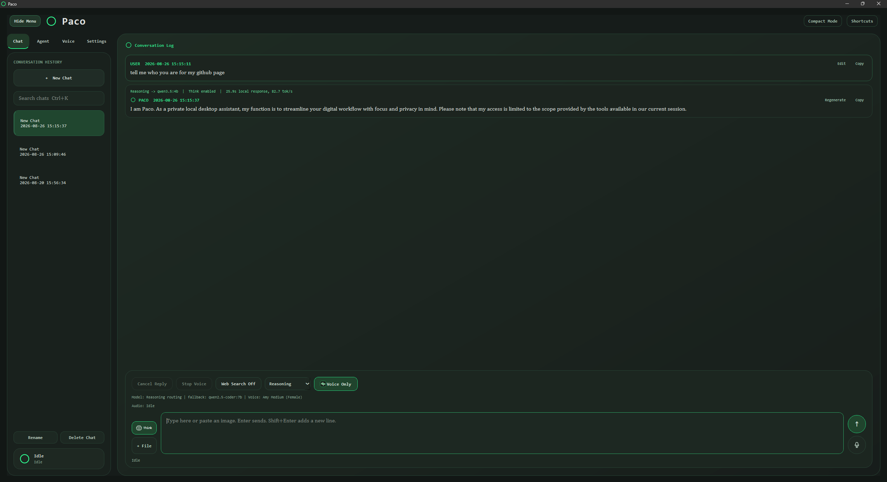

# Paco (Peters Agentic Computer Operator)

Paco is a local-first Windows desktop AI assistant built with PySide6. It combines private Ollama inference, reviewed workspace automation, offline voice services, optional web search, and persistent local conversation history in a Matrix-style interface.

Paco is designed around explicit review boundaries: read-only investigation can run directly, while generated or edited files are shown as a diff before writing. Python execution and other project actions remain bounded and require approval.

## Screenshots



## Contents

- [Quick start](#quick-start)
- [Features](#features)
- [Chat](#chat)
- [Attachments](#attachments)
- [Chat history](#chat-history)
- [Voice](#voice)
- [Web search](#web-search)
- [Model routing](#model-routing)
- [Agent](#agent)
- [Safety and privacy](#safety-and-privacy)
- [Project structure](#project-structure)
- [Development and validation](#development-and-validation)
- [Troubleshooting](#troubleshooting)

## Quick start

Requirements: Windows 10/11, Python 3.12+, and [Ollama](https://ollama.com/) running locally.

```bat
git clone <repository-url> paco
cd paco
python -m venv .venv-win
.venv-win\Scripts\python.exe -m pip install --upgrade pip
.venv-win\Scripts\python.exe -m pip install -r requirements.txt
.venv-win\Scripts\python.exe scripts\download_models.py
scripts\run_local.bat
```

Install at least one Ollama model. This set is tuned for an 8 GB-class GPU:

```bat
ollama pull llama3.2:3b
ollama pull qwen3.5:4b
ollama pull qwen2.5-coder:7b
```

To launch the compact, always-on-top assistant:

```bat
.venv-win\Scripts\python.exe run_compact_assistant.py
```

The model download helper installs the Vosk speech-to-text model and the bundled Piper voice set. Specific voices can be selected with `scripts\download_models.py --voices`.

## Features

- Local chat with Ollama, streaming responses, Markdown, syntax-highlighted code, and visible model status.
- Persistent multi-conversation history with search, drafts, rename/delete, editing, regeneration, and long-chat paging.
- Local document and image attachments for text, code, CSV, PDF, Word, PNG, JPEG, WebP, BMP, and GIF files.
- Automatic model routing through Fast, Balanced, Coding, Reasoning, and Manual profiles.
- Optional source-backed web search with visible links and bounded public-page extraction.
- A conversational Agent for workspace inspection, analysis, reviewed new-file creation, and approved desktop app launching.
- Offline Vosk speech recognition and Piper speech synthesis with Voice Only hands-free mode.
- Responsive compact layout, keyboard shortcuts, status badges, cancellation, and recovery guidance.

## Chat

The Chat tab provides a local Ollama conversation with coalesced token streaming and clear progress states for model loading, generation, and stalled responses. Completed replies can show local timing, token counts, and generation speed when Ollama provides enough information.

User messages can be edited and resent. Editing replaces later messages and resets stale conversation memory. The latest assistant response can be regenerated with the `Regenerate` button or `Ctrl+Shift+R`.

Fenced code blocks include syntax highlighting and a copy action. Markdown links are restricted to safe web URLs; local files, scripts, and embedded resources are blocked.

While a reply is being prepared, Paco can cancel web retrieval or long-chat memory preparation before model generation begins. Canceled replies and model failures remain visible in history with retry or regeneration actions.

## Attachments

Use `+ File`, drop files onto the window, or paste an image with `Ctrl+V`. Attachments are extracted and resized locally before selected content is sent to Ollama. Processing runs away from the Qt UI thread so larger documents do not freeze the interface.

Limits keep local model requests bounded:

- Up to five files and three images per message.
- Text files up to 2 MB.
- PDFs, Word documents, and images up to 12 MB.
- Bounded extracted text, PDF pages, image dimensions, and encoded image data.

Attachment names, sizes, and image thumbnails remain visible in the composer and sent messages. Absolute source paths are not stored in snapshots or sent to Ollama. Scanned PDFs without selectable text require OCR and are rejected with guidance.

## Chat history

Conversations are stored as separate JSON files under `data/chats/`. Each record contains its identifier, title, timestamps, messages, metadata, and any bounded conversation memory.

The history sidebar supports:

- Full-text search across titles, messages, filenames, and extracted attachment text.
- New, open, rename, and delete actions.
- Local per-conversation drafts that restore after restart.
- A second-click confirmation for deletion.
- Newest-message-first loading for long conversations, with `Load earlier messages` paging.

Writes use atomic replacement and backup recovery. If a reply cannot be saved, the answer stays visible and the UI offers `Retry Save` instead of silently losing it. The last active tab, conversation, and valid window geometry are restored on launch.

## Voice

The Voice tab uses Vosk for local speech recognition and Piper for local speech synthesis. It provides:

- Multiple installed Piper voices.
- Voice preview text and test playback.
- Adjustable speaking rate and volume.
- Microphone and speaker selection with Windows default-device fallback.
- Persistent microphone mute and spoken-response settings.
- Status for speech models, devices, playback, and transcription.

Voice Only listens for sustained speech and sends after trailing silence. It includes a live microphone waveform, keyboard-accessible controls, a 30-second capture limit, and recovery guidance when a USB, Bluetooth, or virtual microphone disappears.

Hands-Free mode resumes listening after a complete spoken reply. A short delay prevents speaker-tail echo. Muting, stopping playback, leaving Voice Only, and synthesis errors cancel automatic resume safely.

## Web search

Web search is disabled by default. Current location-specific weather uses account-free Open-Meteo geocoding and live observations. Current and news queries can use Google News RSS. General searches use Brave Search when `BRAVE_SEARCH_API_KEY` is present, optional Google Custom Search, Yahoo web results, then Bing RSS as the final fallback. Results are ranked by query relevance before provider, deduplicated, filtered for freshness and minimum topic coverage, shown with visible sources, and supplemented with bounded extraction from selected public pages.

Search requests can also fetch explicitly supplied public URLs. Paco blocks private and loopback targets, unsafe redirects, unsupported content types, oversized downloads, excessive redirect chains, and credential-bearing URLs. Extracted page content is treated as untrusted data and limited before it reaches the local model.

If providers fail or return only weak or stale matches, Paco reports that no suitable sources were found and continues with a local-only response. Brave Search requires `BRAVE_SEARCH_API_KEY`. Optional Google Custom Search requires both `GOOGLE_SEARCH_API_KEY` and `GOOGLE_SEARCH_ENGINE_ID`. Credentials are read from the process environment and are not saved in Paco settings or history.

## Model routing

The composer supports these profiles:

- `Auto`: selects an installed model based on the request.
- `Fast`: favors a smaller responsive model.
- `Balanced`: favors a stronger general-purpose model.
- `Coding`: favors a coding model and coding-specific guidance.
- `Reasoning`: favors a stronger model for analysis and trade-offs.
- `Manual`: always uses the model selected in Settings.

The default RTX 2070 routing favors `llama3.2:3b` for fast prompts, `qwen3.5:4b` for balanced, reasoning, and image work, and `qwen2.5-coder:7b` for coding. Vision prompts are not sent to text-only models. Each response records the selected profile and model.

Settings includes a curated local-model installer with streamed progress and cancellation. Ollama manages model storage, and canceled downloads may leave reusable partial data.

Long chats use conservative token estimates and bounded conversation memory. When older turns no longer fit, Paco locally summarizes requirements, decisions, outcomes, and unresolved work before responding. Memory cannot execute transcript commands and falls back to extractive notes if summarization is unavailable.

## Agent

The Agent tab supports natural-language workspace questions, read-only investigation, reviewed new-file creation, and known Windows app launching. Examples:

```text
list files
analyze workspace for startup errors
where are authentication tokens validated?
list project scripts
create a file called notes.txt with content Buy milk
create a Python file src/health.py that exposes a health check
open Notepad
```

Agent results appear as bounded command, result, and error cards in a task timeline. Each task records its workspace, status, duration, and output. Output can be copied or exported as a new `.txt`, `.log`, or `.md` file inside `sandbox/`.

Workspace access is controlled per folder:

- `Create-only` permits bounded inspection and exclusive creation of new files.
- `Read-only` permits inspection but blocks file creation.

Existing files cannot be edited, replaced, or deleted. Tests, builds, linting, formatting, Python execution, and project scripts are blocked from Agent actions. New-file requests remain a preview until the user selects `Create File`; paths and generated Python, JSON, or TOML are validated before creation.

Workspace analysis ranks relevant files, sends bounded line-numbered excerpts to the local reasoning model, and cites the sources it reviewed. Sensitive files, binary files, dependency folders, caches, credentials, private keys, and oversized files are excluded.

## Safety and privacy

- Ollama, Vosk, Piper, chat history, and attachment processing remain local by default.
- Enabling web search sends queries and bounded public-source requests outside the machine.
- Agent paths are resolved inside the active `sandbox/` workspace and fail closed on escapes.
- File creation is exclusive; existing files are never silently overwritten.
- Generated changes require a visible diff and explicit approval.
- Model output, repository text, search results, and task output are treated as untrusted data.
- Subprocesses use fixed arguments, bounded output, cancellation, and timeouts.
- Runtime state, model weights, caches, credentials, and virtual environments are excluded from Git.

## Project structure

```text
run_assistant.py                 Full application entry point
run_compact_assistant.py         Compact assistant entry point
src/local_matrix_assistant/
  core/                           Configuration, models, and catalogs
  services/                       Models, history, audio, workspace, and processes
  ui/                             PySide6 windows, panels, workers, and themes
scripts/                          Launch, model-download, and self-check helpers
tests/                            Standard-library unittest coverage
```

## Development and validation

Use the Windows virtual environment:

```bat
.venv-win\Scripts\python.exe -m unittest discover -s tests
.venv-win\Scripts\python.exe -m compileall -q src
scripts\self_check_windows.bat
```

Run one focused test module with:

```bat
.venv-win\Scripts\python.exe -m unittest tests.test_workspace_actions
```

For a full microphone-to-speaker diagnostic:

```bat
scripts\self_check_windows.bat --voice-roundtrip
```

## Troubleshooting

- `Ollama Offline`: start Ollama and confirm `http://127.0.0.1:11434` responds.
- `Selected model is not installed`: pull the selected model, then refresh status in Paco.
- Missing speech models: run `.venv-win\Scripts\python.exe scripts\download_models.py` again.
- Silent voice output: leave the speaker on the automatic Windows default first, then choose an explicit device.
- No web sources: check internet access; Paco falls back to a local-only reply.

## Status

Paco is an actively developed personal desktop application. Windows is the primary supported platform. Linux launch support exists for basic development, but feature parity is not guaranteed.
